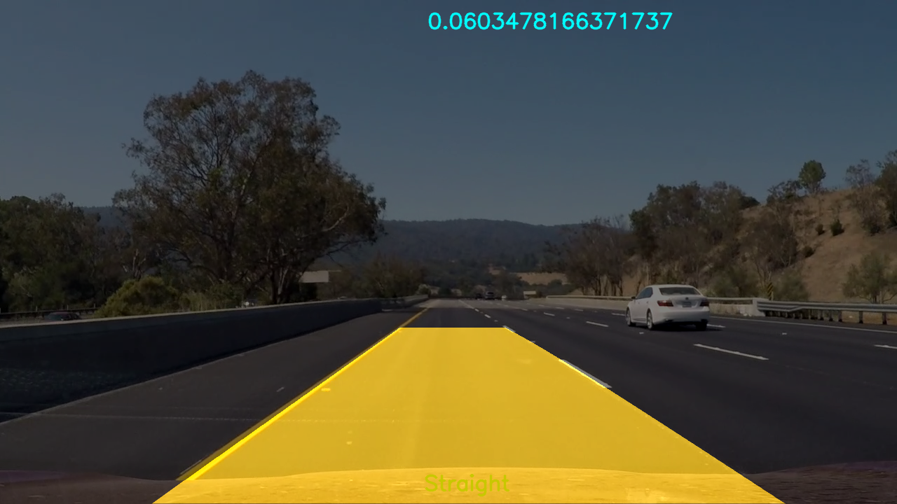
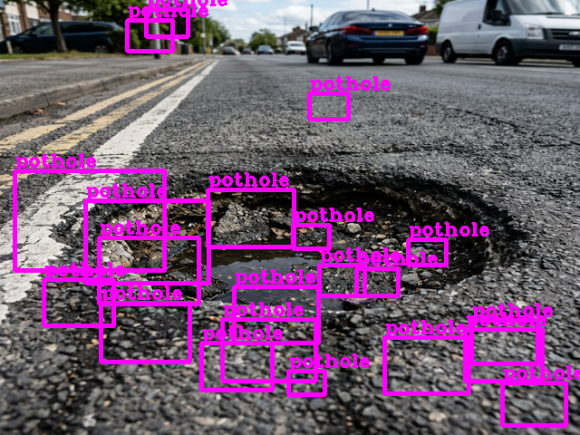
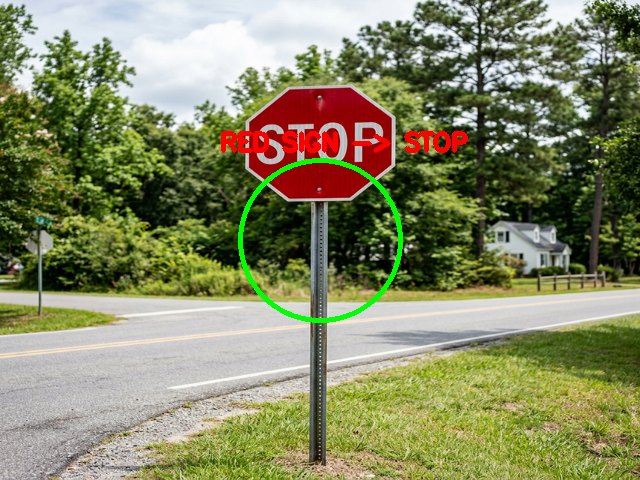
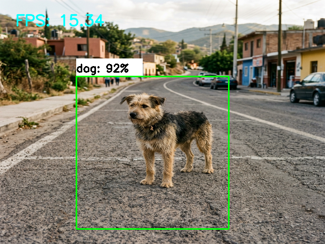

# Quad-Vision-AutoDrive: Autonomous Vehicle Subsystems 🚘

This repository contains the source code for an autonomous vehicle project designed to handle multiple real-world scenarios. The system is optimized to run on a Raspberry Pi using a Pi Camera and an L298N Motor Driver, providing a unified solution for road navigation and safety. 

## 🚗 Project Features
- **Lane Tracking:** Uses OpenCV computer vision pipelines (Hough transforms, Sobel edge detection, and perspective warping) to calculate lane curvature and keep the vehicle centered.
- **Pothole Detection:** Utilizes Haar Cascades to detect potholes on the road and commands the vehicle to stop to avoid damage.
- **Traffic Sign Recognition:** Uses Hough Circles and K-Means color clustering to detect speed bumps/stop signs (Red) and turn indicators (Blue), overriding lane-following to make required maneuvers.
- **Animal Detection (TFLite):** Uses a quantized SSD MobileNet model to detect animals or pedestrians in the path to initiate an emergency stop. (*Note: Requires `tflite-runtime` available on Raspberry Pi*).

## 📁 Repository Structure
```
.
├── archive_legacy        # Original prototypes and legacy scripts
├── data
│   ├── cal_pickle.p         # Camera calibration parameters
│   ├── project_video.mp4    # Demo video for lane tracking
│   ├── test.mp4             # Demo video for testing
│   └── test1.jpg            # Sample image
├── models
│   ├── cascade.xml          # Haar cascade model for potholes
│   └── Sample_TFLite_model  # Folder containing quantized TFLite model and labels
├── src
│   ├── animal_detector.py   # TFLite inference logic
│   ├── lane_tracker.py      # OpenCV lane detection pipeline
│   └── obstacle_detector.py # Pothole & sign logic with Pi GPIO mapping
├── main.py                  # The unified orchestration script
└── README.md                # This file
```

## 🛠️ Hardware Requirements
- **Raspberry Pi 3/4** running Raspberry Pi OS.
- **Pi Camera Module** (or compatible USB webcam).
- **L298N Motor Driver** connected to 4 DC motors.
- **Power Supply** suitable for the motors and the Pi.

### GPIO Pin Mapping
By default, the motors use BCM pins:
- `IN1`: GPIO 2
- `IN2`: GPIO 3
- `IN3`: GPIO 4
- `IN4`: GPIO 17

## 💻 Software Setup

### On Raspberry Pi
1. Clone the repository: `git clone <repo_url>`
2. Install system dependencies: `sudo apt-get install python3-opencv`
3. Install Python libraries:
   ```bash
   pip3 install numpy scipy scikit-learn
   ```
4. Install TensorFlow Lite Runtime for Raspberry Pi:
   ```bash
   pip3 install tflite-runtime
   ```

## 🚀 Running the System

### 1. Live Autonomous Mode (Raspberry Pi)
To run the system using the live camera feed and activate the GPIO motor controllers:
```bash
python3 main.py
```

### 2. Demo Mode (Any PC/Mac/Linux)
If you want to verify the algorithm without physical hardware, you can run the system in demo mode. This reads `data/test.mp4` or `data/project_video.mp4`, outputs the actions to the console, and saves the processed video to `data/demo_output.avi`.

```bash
python main.py --demo --video data/test.mp4
```

## ⚙️ How It Works (`main.py`)
The main script orchestrates the pipeline frame-by-frame in strict priority:
1. **Critical Obstacles (Potholes/Animals):** If detected, the vehicle issues a **STOP** command immediately.
2. **Traffic Signs:** If a red sign is detected, it issues a **STOP**. If a blue sign is detected, it overrides steering.
3. **Lane Navigation:** If no obstacles or signs exist, the OpenCV pipeline determines the `lane_curve` and issues **FORWARD**, **LEFT**, or **RIGHT** adjustments to stay centered.

## 🧪 Algorithmic Verification
The models and pipelines were tested on sample imagery to verify detection accuracy before running on the physical Raspberry Pi. 

### 1. Lane Tracking
The OpenCV pipeline correctly detects lane boundaries, applies perspective wrapping, and determines road curvature.


### 2. Pothole Detection
The Haar Cascade `cascade.xml` detects circular road deformations (potholes) accurately to trigger emergency stops.


### 3. Traffic Sign Recognition
Hough circles paired with color space bounding boxes (K-Means) accurately isolate Red stop signs.


### 4. Animal Detection (TFLite)
The quantized SSD MobileNet model detects stray animals and draws bounding boxes to avoid collisions.



